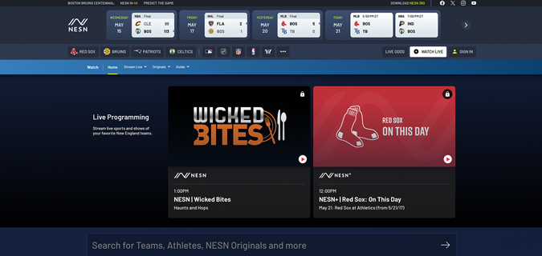
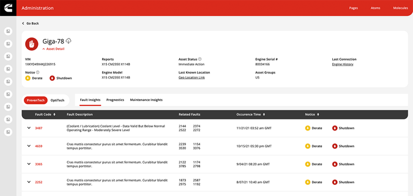
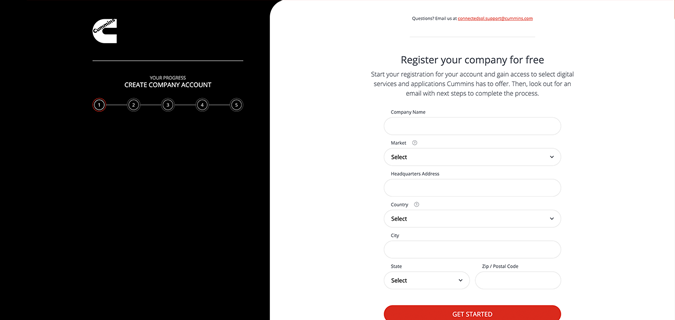
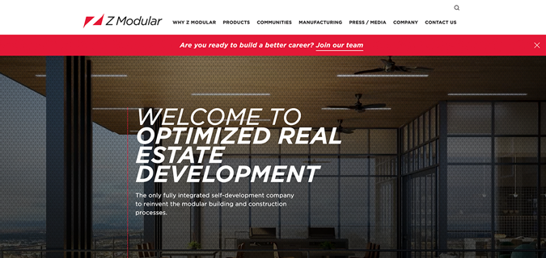

#  THADDEUS BRIGGS PORTFOLIO

Thanks for visiting my portfolio repository. Below you will find a collection of web sites and web applications I have worked on over the years.

 

|&nbsp;|&nbsp;|Quick Links|&nbsp;|&nbsp;|
|:----------------:|:------------:|:------------:|:------------:|:------------:|
|[NESN][nesn]|[vAuto][vauto]|[Cummins][cummins]|[Z Modular][zmodular]|[Golftec][golftec]|
|[PK Associates][pka]|[ami + partners][ami]|[Bio2 Medical][bio2]|[Cairn Dental][cairn]|[Devetry][devetry]|
|[Emailage][emailage]|[Proctor Productions][proctor]|[Szymanowski Orthodontics][damon]|[10up Projects][10up]|[The Mx Group Projects][mx]|

 

## Resume

 

 

## NESN

 

<a href="https://nesn.com/" target="_blank">View Site</a>
<a href="https://nesn.com/watch/" target="_blank">View React App</a>

Due to a strict non-disclosure agreement, I can't share my code for the work I did while employed at NESN, however I was the sole React developer for their WordPress editorial site and the NESN 360 streaming application.

#### Project Highlights:

* Custom WordPress plugin to house and streamline block development
* React single page application for streaming and VOD content
* Custom blocks, block templates, and block patterns
* Dynamic block content that consumed and displayed API data
* Various React components using React Hooks, React Router, and the Context API
* Refactor of the subscriber onboarding flow to integrate new customer facing promotions

 

## vAuto

 

<a href="https://vauto.com/" target="_blank">View Site</a> | [View Code](/vauto)

vAuto was my first WordPress site built with the Block Editor, also known as Gutenberg. To streamline block development, I created a WordPress plugin to house all React based blocks and components.

#### Project Highlights:

* Enhanced editor experience, that matches the front end
* Custom blocks, block templates, and block patterns
* Dynamic block content generated from custom post types
* Utilizes theme.json for seamless theme/block integration
* Video features, animations, and interactive content

 

## Cummins Connected Solutions

 

[View Code](/cummins/connected-solutions)

The Cummins development team needed help building the UI for their internal fleet management application. This single page application is a workng prototype of all the components and UI elements I built and styled for thier integration.

#### Project Highlights:

* Single page application built with React.js and Next.js
* Robust design system based on atomic design principles
* Visual style guide and component library
* Complete page templates utilizing and connecting individual React components
* Placeholder data to simplify the consumption of API data at the time of integration
* Interactive form handling and state management to simulate data validation and functionality
* Complex modal and table functionality throughout the application

 

## Cummins Onboarding UI

 

[View Code](/cummins/onboarding-ui)

This basic single page application is a prototype of a multi-step onboarding form. The Cummins development team integrated these UI elements into their internal React application.

#### Project Highlights:

* Single page application built with React.js and Next.js
* Multi-step form functionality with various form elements
* Flexible React components with prop handling and defined prop types
* Custom animations using Framer Motion

 

## Z Modular

 

[View Code](/z-modular/theme-files)

This B2B marketing website was a lot of fun to build! Z Modular takes a modular approach to the building and construction process...similar to the approach I take when building web experiences!

#### Project Highlights:

* Modular development and content managment with Advanced Custom Fields
* Interactive video slider using the YouTube Data API
* Fun video feature with appealing design and overlay
* Ajax filtering for their community portfolio

 

## Golftec

 

<a href="https://golftec.com/" target="_blank">View Site</a> | [View Code](/golftec)

This project was the blueprint for GolfTEC's website redesign. It consists of a styleguide, pattern library, custom modules, and demo pages which were integrated with their company's proprietary CMS.

#### Project Highlights:

* KSS Styleguide
* Unique Navigation
* Static/Video Slider
* Subtle Hover Animations
* Complex Location Maps

 

## PK Associates

 

<a href="https://pkastructural.com/" target="_blank">View Site</a> | [View Code](/pk-associates/theme-files)

This structural engineering firm is known for their award-winning designs. Since their work speaks for itself, the portfolio page is the key to their marketing funnel. Check out the custom portfolio grid which features AJAX filtering & search.

#### Project Highlights:

* Creative Portfolio Grid
* AJAX Filtering & Search
* Custom Taxonomies
* Unique Design & Interface
* Strategic Content Funnel

 

## ami + partners

[View Code](/ami/theme-files)

One of my favorite sites to date. I love the clean, yet rich design which appeals directly to AMI's target audience - marketing executives. This site is thoughtfully laid out and takes a content first approach. This website has been redesigned and rebuilt since my original work.

#### Project Highlights:

* Sticky Navigation
* Parallax Scrolling
* CSS/SVG Animations
* Custom Post Types
* User-friendly Case Studies

 

## Bio2 Medical

 

[View Code](/bio2-medical/theme-files)

This medical device company specialized in state-of-the-art technology. It's vital that their website appeal to modern medical professionals, but remain user-friendly for those less tech savvy. This company was acquired and the website is no longer available.

#### Project Highlights:

* YouTube Video Hero
* Multi-Lingual Content
* Client Portal
* Timeline Carousel
* Custom Search

 

## Cairn Dental

 

[View Code](/cairn-dental/theme-files)

Cairns are the piles of stones placed next to hiking trails. They mark the path and help guide hikers to their destination. I love the rebrand of this dental practice and how it targets the outdoor enthusiasts of Golden, CO. This website has been redesigned and rebuilt since my original work.

#### Project Highlights:

* Subtle Hover Effects
* Custom Post Types
* Clean, Modern Blog
* Social Sharing
* Interactive FAQs

 

## Devetry

 

[View Code](/devetry/theme-files)

Devetry specializes in app development and they wanted a creative way to feature their amazing work. Check out the video slider on the home page. The videos play when they're in view or when the slide changes. Unfortunately, this website has been rebranded, redesigned, and rebuilt since my original work.

#### Project Highlights:

* Unique Video Slider
* Distinctive Image Grid
* Strategic Landing Pages
* Project Case Studies
* AJAX Filtering

 

## Emailage

 

[View Code](/emailage/theme-files)

I thoroughly enjoyed building this website. I love how the design incorporates soft curves, circular imagery, and custom icon illustrations. Modular development with feature-rich integrations lead to this highly customizable experience. Please note that this company was aquired by LexisNexis and this website is no longer available.

#### Project Highlights:

* Multi-Lingual Site
* Soft, Modern Design
* Flexible Modules & Layouts
* Adaptive Placeholders
* AJAX Filtering & Search

 

## Proctor Productions

 

[View Code](/proctor-productions/theme-files)

Nominated for an Awwward, this site originally featured full screen videos, nested sliders, and AJAX sorting for their work section. The team page highlights the fun & creative culture at Proctor. This website has been redesigned and rebuilt since my original work.

#### Project Highlights:

* Mosaic Project Filtering
* Parallax Scrolling
* CSS/SVG Animations
* Background Video
* Fun Team Hover Effects

 

## Szymanowski Orthodontics

 

[View Code](/szymanowski-orthodontics/theme-files)

My first site at Zenman, the boss wanted to challenge me to see what I could do. This design has all the bells & whistles: parallax scrolling, CSS/SVG animations, background videos, and much more! This website has also been rebuilt since my original work.

#### Project Highlights:

* Animated Header
* Dynamic Heros Images
* Slow Parallax Scrolling
* CSS/SVG Animations
* Background Video

 

## The Mx Group Projects

 

Here are a few additional projects that I worked on at The Mx Group:

**The Mx Group** 
<https://www.themxgroup.com/> 
Rebuilt our internal site from the ground up starting from a rebrand and redesign. WordPress site built with Advanced Custom Fields.

**Cummins** 
<https://www.cummins.com/> 
During the Cummins website redesign, I built and styled all the UI components used on the new site. I created a style guide and component library which were integrated with their existing Drupal CMS.

I also built several new features, components, and page templates for the following WordPress sites:

**Zekelman**  
<https://www.zekelman.com> 

**Picoma** 
<https://www.picoma.com> 

**Atlas Tube** 
<https://www.atlastube.com> 

**Western Tube** 
<https://www.westerntube.com> 

**Hayes Modular** 
<https://www.hayesmodular.com> 

**Sharon Tube** 
<https://www.sharontube.com> 

 

## 10up Projects

 

Due to a strict non-disclosure agreement, I can't share my code for the work I did while employed at 10up, however here is a brief summary of the projects I worked on:

**Microsoft - AI Blog** 
<https://blogs.microsoft.com/ai> 
Completed minor bug fixes and styling changes throughout the site.

**Microsoft - In Culture** 
<https://www.microsoft.com/inculture> 
Conducted user testing and bug fixes. Also built various new features and components.

**Microsoft - Industry Blogs** 
<https://cloudblogs.microsoft.com/industry-blog> 
Built complex navigation feature with AJAX filtering.

**Microsoft - Today In Tech**  
<https://blogs.microsoft.com/today-in-tech> 
Conducted user testing and bug fixes. Minor component updates throughout the site.

**NBA2K League** 
<https://2kleague.nba.com> 
Built several components, features, and page templates under a tight deadline.

**ABC News - FiveThirtyEight** 
<https://fivethirtyeight.com> 
Built several features, components, and AMP updates.

**ESPN - TheUndefeated (Rebranded to Andscape)** 
<https://theundefeated.com> 
Built several features, components, and AMP updates.

 

[nesn]: #nesn
[vauto]: #vauto
[cummins]: #cummins
[zmodular]: #z-modular
[golftec]: #golftec
[pka]: #pk-associates
[ami]: #ami--partners
[bio2]: #bio2-medical
[cairn]: #cairn-dental
[devetry]: #devetry
[emailage]: #emailage
[proctor]: #proctor-productions
[damon]: #szymanowski-orthodontics
[mx]: #the-mx-group-projects
[10up]: #10up-projects
